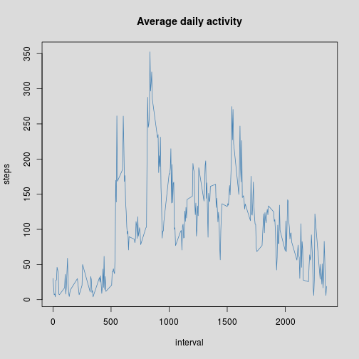
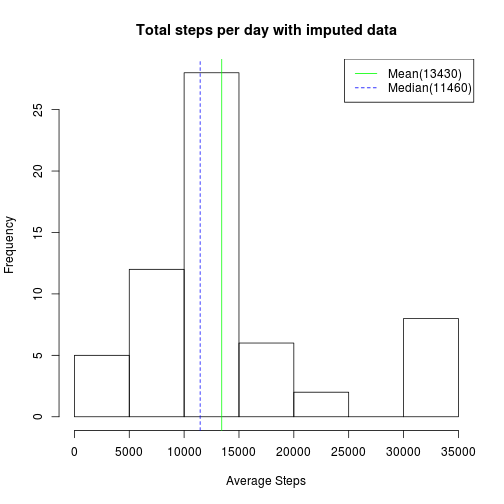
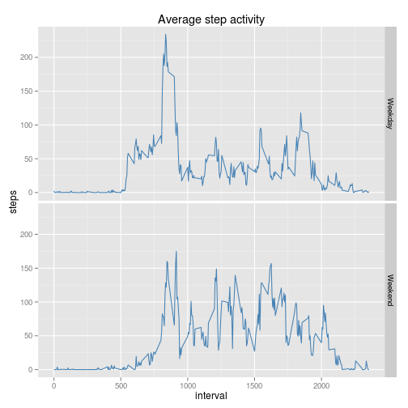

# Reproducible Research: Peer Assessment 1


## Global settings

```r
options(digits = 7) #Option to fix strange results when using summary with knitr
library(ggplot2)
```

## Loading and preprocessing the data


```r
if(!file.exists('activity.csv')){
  message('Attempting to extract activity data...')
  if(file.exists('activity.zip')){
    unzip('activity.zip')
    message('Successfully unzipped activity data')
  }
  else{
    message('Failed to extract data, activity.zip not found')
  }
    
}

activity_data <- read.csv('activity.csv')

#convert $date from factor to Date
activity_data$date <- as.Date(activity_data$date)

#remove na values
clean_data <- activity_data[which(activity_data$steps > 0),]
```

## What is mean total number of steps taken per day?

```r
steps_per_day <- aggregate(steps ~ date, clean_data, sum)
step_summary <- summary.default(steps_per_day$steps)
#Create histogram plot
hist(steps_per_day$steps, main='Total steps per day', xlab='Average Steps', breaks=10)

#plot mean
abline(v=step_summary['Mean'], col='green')
#plot median
abline(v=step_summary['Median'], col='blue', lty=2)

legend("topright", 
       c(sprintf("Mean(%i)", step_summary['Mean']), 
         sprintf("Median(%i)", step_summary['Median'])), 
       col=c("green", "blue"), 
       lty=c(1,2),
       lwd=1)
```

 

## What is the average daily activity pattern?

```r
avg_steps_per_interval <- aggregate(steps ~ interval, clean_data, mean)
par(bg='gray86')
plot(avg_steps_per_interval, type='l', col='steelblue', main='Average daily activity')
```

 

```r
highest_interval_step_avg <- avg_steps_per_interval[which.max(avg_steps_per_interval$steps),]
sprintf('Interval with highest step average: Interval %i with %0.2f average steps', highest_interval_step_avg$interval, highest_interval_step_avg$steps)
```

```
## [1] "Interval with highest step average: Interval 835 with 352.48 average steps"
```

## Imputing missing values

```r
sprintf("Number of missing values: %i", sum(is.na(activity_data$steps)))
```

```
## [1] "Number of missing values: 2304"
```

```r
message('Assuming consistent activity, converting missing values to mean of interval')
```

```
## Assuming consistent activity, converting missing values to mean of interval
```

```r
imputed_data <- activity_data

for(x in which(is.na(imputed_data$steps))){
    i <- which(avg_steps_per_interval$interval == imputed_data$interval[x])
    imputed_data[x,'steps'] <- if(length(i) > 0) avg_steps_per_interval$steps[i] else mean(avg_steps_per_interval$steps)
}


steps_per_day <- aggregate(steps ~ date, imputed_data, sum)
step_summary <- summary.default(steps_per_day$steps)
#Create histogram plot
hist(steps_per_day$steps, main='Total steps per day with imputed data', xlab='Average Steps', breaks=10)

#plot mean
abline(v=step_summary['Mean'], col='green')
#plot median
abline(v=step_summary['Median'], col='blue', lty=2)

legend("topright", 
       c(sprintf("Mean(%i)", step_summary['Mean']), 
         sprintf("Median(%i)", step_summary['Median'])), 
       col=c("green", "blue"),
       lty=c(1,2), 
       lwd=1)
```

 

#### Report
Imputing the missing data with the average steps of respective intervals seems to largely increase the high end values shifting the gap to the right more(i.e between 25,000 and 30,000), The mean and median both increase and diverge with the imputed data but the shape of the distribution does not change much.

## Are there differences in activity patterns between weekdays and weekends?


```r
message('Adding weekday factor')
```

```
## Adding weekday factor
```

```r
activity_data$daytype <- apply(activity_data, 1, function(row) if(weekdays(as.Date(row['date']))  %in% c('Sunday','Saturday')) 'Weekend' else 'Weekday')
levels(activity_data$daytype) <- c('Weekend', 'Weekday')

ggplot(na.omit(activity_data), aes(x=interval, y=steps)) +
  ggtitle('Average step activity') +
  stat_summary (fun.y = mean, geom="line", col='steelblue') +  # calculate mean by interval group
  facet_grid(daytype~.) #add multiple panels by daytype (weekend/weekday)
```

 
#### Report

There seems to be an indication that the amount of walking may be enhanced over the weekend, which may be possible that people walk less during the week due to their working environment, i.e sitting at a computer. There is a clear margin between average steps in the morning between 600 and 800, on weekends it is far less and this could be among many reasons including, but not limited to hangovers, procrastination, and just pure relaxation.
